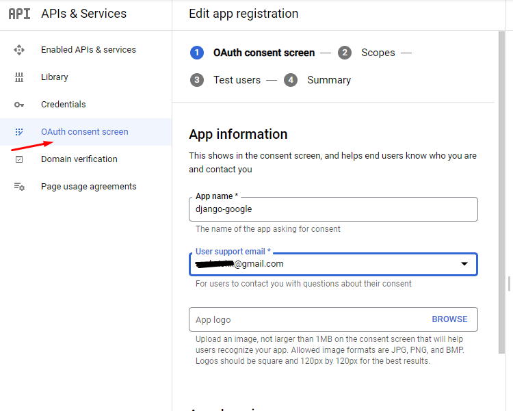

# Django Google Authentication using django-allauth

- pip install django-allauth

```
AUTHENTICATION_BACKENDS = [
    ...
    # Needed to login by username in Django admin, regardless of `allauth`
    'django.contrib.auth.backends.ModelBackend',

    # `allauth` specific authentication methods, such as login by e-mail
    'allauth.account.auth_backends.AuthenticationBackend',
    ...
]
```

```
INSTALLED_APPS = [

    'django.contrib.sites',
    'allauth',
    'allauth.account',
    'allauth.socialaccount',
    'allauth.socialaccount.providers.google',
]

SITE_ID = 1

SOCIALACCOUNT_PROVIDERS = {
    'google': {
        # For each OAuth based provider, either add a ``SocialApp``
        # (``socialaccount`` app) containing the required client
        # credentials, or list them here:
        'APP': {
            'client_id': '123',
            'secret': '456',
            'key': ''
        }
    }
}

```

```
urlpatterns = [
    ...
    path('accounts/', include('allauth.urls')),
    ...
]
```


python manage.py migrate


- Configuring Google APIs


   - https://console.cloud.google.com/apis/dashboard

   - adresine giderek google hesabımız ile oturum acıyoruz

   

   - CREATE PROJECT ile devam ediyoruz

   
    
    - projeyi oluşturduktan sonra "OAuth consent screen" bolumune geciyoruz.

    

    - app-name ve email adresi girilip kaydedilir. Sonra Credentials bolumune geciyoruz.

     

    - Authorized urls ve Authorized redirect URIs kısımlarını, djangonun web server olan 127.0.0.1:8000 seklinde yazdık fakat uygulama bir servera deploy edildiyse domain adı girilmelidir ve create edilmelidir. Create edildikten sonra Your Client ID ve Your Client Secret keyleri cıkacaktır.


- Add social app in Django admin

   - Admin panelimizi aciyoruz, super user oluşturmadıysak `python3 manage.py createsuperuser` komutu ile super user oluşturduk.

   - Admin dashboard da, asagida belirtilen bolumlari dolduruyoruz.

    

    - Urlpatterns dizaynimiza gore default gelen bağlantıya gidilerek test edebiliriz. 
     
    - http://127.0.0.1:8000/accounts/google/login/

    - Google ile oturum acildiktan sonra http://127.0.0.1:8000/admin/socialaccount/socialaccount/ baglanti adresinden kullanıcı bilgilerine ulasilmaktadir.
   
    - Mevcut gelen kullanıc bilgilerine asagidaki gibi ulasip kullanabiliriz.

    ```
          Avatar URL: {{ user.socialaccount_set.all.0.get_avatar_url }}
          UID: {{ user.socialaccount_set.all.0.uid }}
          Date Joined: {{ user.socialaccount_set.all.0.date_joined}}
          Last Login: {{ user.socialaccount_set.all.0.last_login}}
          Full Name: {{ user.socialaccount_set.all.0.extra_data.name }}
    ```


- kaynakca
   - https://dev.to/mdrhmn/django-google-authentication-using-django-allauth-18f8

  - https://github.com/wagnerdelima/drf-social-oauth2

  - https://django-allauth.readthedocs.io/en/latest/installation.html

  - https://www.youtube.com/watch?v=NG48CLLsb1A&ab_channel=JustDjangohttps://www.youtube.com/watch?v=NG48CLLsb1A&ab_channel=JustDjango

  - https://django-allauth.readthedocs.io/en/latest/installation.html